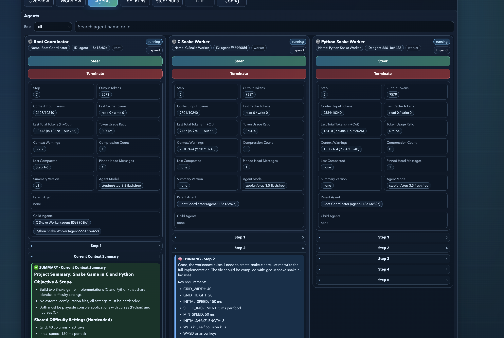
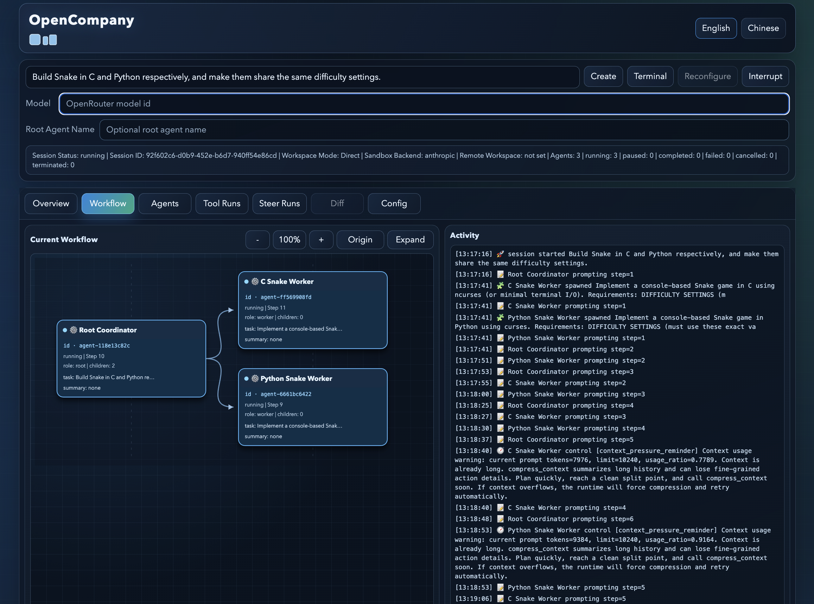

# OpenCompany

Language: **English** | [中文](README_cn.md)

> ✨ In OpenCompany, every agent and user can self-organize to recruit or terminate teams, act autonomously, and collaborate through direct communication with other agents.
> 
> 🤖 Most of the code is completed by [Codex](https://openai.com/codex/).
> 
> 📮 Feedback: bebetterest@outlook.com

## 📚 Table of contents

- ✨ Features
- 📸 Screenshots
- 🚀 Quick start (Web UI first)
- 🖥️ TUI
- 💻 CLI command cheat sheet
- ⚙️ Configuration and debugging
- 🔒 Runtime safety model
- 🌐 Remote Direct Mode (SSH)
- 🗂️ Logs and persistence
- 🧱 Repository layout
- 📖 Further reading

## ✨ Features

- 🧩 Agent self-organization: each `agent` can create or terminate child teams, decompose and assign work, run feedback loops, message other agents, and submit results upstream.
- ⏱️ Asynchronous execution: agents can launch long-running tools asynchronously (for example subagent creation/delegation, inter-agent messaging, and long shell runs), inspect agent/tool state, and decide whether to keep going or block on waits.
- 🎛️ Steerability: users can create or terminate agents at any time, send steer messages to any agent, or open a terminal aligned with the same agent execution environment.
- 🧠 Context management: agents can autonomously call context compression tools on demand to control context growth while preserving key information.
- 📏 Limit policies: built-in limits cover tool-call duration, total created agents, and active agents; periodic reminder context is injected when step/context thresholds are reached, and overlong context is force-compressed.
- 🌐 Project environments: supports both local directories and remote SSH Linux directories as execution environments.
- 📝 Workspace modes: supports `Direct` and `Staged`; `Direct` writes to the project immediately, while `Staged` holds diffs for user approval before apply (remote supports `Direct` only).
- 🔒 Security model: supports both `anthropic` [sandbox (SRT)](https://github.com/anthropic-experimental/sandbox-runtime) and `none` (unconstrained) runtime backends.
- 🖥️ Three interfaces: supports Web UI / TUI / CLI, with Web UI recommended (bilingual visualization in Chinese/English covers session overview, collaboration graph, per-agent details, tool/steer traces, and operations like session create/import, config updates, agent create/steer/terminate, and opening agent terminals).
- 🤖 LLM access: supports model calls through [OpenRouter](https://openrouter.ai/).

## 📸 Screenshots





## 🚀 Quick start (Web UI first)

1. Set up a Python environment (choose one path; both include editable install and dev deps):

```bash
# Option A: Conda
conda env create -f environment.yml
conda activate OpenCompany

# Option B: uv
uv venv --python 3.12 .venv
source .venv/bin/activate
uv pip install -e ".[dev]"
```

`uv` installs Python packages only. Ensure `ripgrep` is available on your system PATH; if you use the default Anthropic sandbox backend, also ensure `node`/`npm` is available.

2. Configure your OpenRouter API key:

```bash
export OPENROUTER_API_KEY="your_api_key"
```

Optional:

```bash
cp .env.example .env
```

3. If you use `[sandbox].backend = "anthropic"` (default), install Node dependency for sandbox runtime:

```bash
npm install
```

4. If you use remote password auth (`--remote-auth password`), install local `sshpass`:

```bash
# macOS
brew install hudochenkov/sshpass/sshpass

# Debian/Ubuntu
sudo apt-get install sshpass
```

5. Launch Web UI:

```bash
opencompany ui
```

Default address: `http://127.0.0.1:8765`

```bash
opencompany ui --host 0.0.0.0 --port 9090
```

## 🖥️ TUI

TUI is still supported as a fallback interface:

```bash
opencompany tui
opencompany tui --project-dir /path/to/target
opencompany tui --workspace-mode staged
opencompany tui --session-id <session_id>
opencompany tui --remote-target demo@example.com --remote-dir /home/demo/workspace --remote-auth key --remote-key-path ~/.ssh/id_ed25519
```

Rules:

- Remote flags are for creating new sessions only.
- Do not combine remote flags with `--session-id`.
- Do not combine `--workspace-mode` with `--session-id`.
- `staged` mode does not support remote workspace.

## 💻 CLI command cheat sheet

Run one task in current directory:

```bash
opencompany run "Inspect this repository and propose next engineering steps."
```

Run against another project:

```bash
opencompany run --project-dir /path/to/target "Inspect this repository and propose next engineering steps."
```

Run in staged mode:

```bash
opencompany run --workspace-mode staged "Inspect this repository and propose next engineering steps."
```

Run in direct mode against remote SSH workspace:

```bash
opencompany run \
  --remote-target demo@example.com:22 \
  --remote-dir /home/demo/workspace \
  --remote-auth key \
  --remote-key-path ~/.ssh/id_ed25519 \
  --remote-known-hosts accept_new \
  "Inspect this repository and propose next engineering steps."
```

Continue an existing session:

```bash
opencompany resume <session_id> "new instruction"
```

Apply / undo staged project sync:

```bash
opencompany apply <session_id>
opencompany undo <session_id>
# non-interactive
opencompany apply <session_id> --yes
opencompany undo <session_id> --yes
```

Export session logs:

```bash
opencompany export-logs <session_id>
opencompany export-logs <session_id> --export-path /tmp/session-export.json
```

Query persisted messages:

```bash
opencompany messages <session_id>
opencompany messages <session_id> --agent-id <agent_id> --tail 100
opencompany messages <session_id> --cursor <next_cursor> --include-extra --format text
```

Query persisted tool runs:

```bash
opencompany tool-runs <session_id>
opencompany tool-runs <session_id> --status running --limit 200 --cursor <next_cursor>
```

Tool-run metrics:

```bash
opencompany tool-run-metrics <session_id>
opencompany tool-run-metrics <session_id> --export
opencompany tool-run-metrics <session_id> --export --export-path /tmp/tool_run_metrics.json
```

Open session terminal or run terminal parity self-check:

```bash
opencompany terminal <session_id>
opencompany terminal <session_id> --self-check
```

Notes:

- `opencompany run` and `opencompany resume` show a live status panel in interactive terminals.
- Panel supports auto pagination every `5s`; press `=` / `+` / `-` for manual page switching.
- Use `--preview-chars N` to adjust per-field preview width (default `256`).

## ⚙️ Configuration and debugging

`opencompany.toml` is the source of truth.

Key config groups:

- `[project]`: app name, default locale, runtime data dir.
- `[llm.openrouter]`: model(s), retry policy, timeout, sampling.
- `[runtime.limits]`: orchestration limits (children/active agents/step budgets/reminder intervals).
- `[runtime.tool_timeouts]`: default and per-tool timeouts.
- `[runtime.tools]`: root/worker tool allowlists, `steer_agent_scope`, list pagination, shell inline wait.
- `[runtime.context]`: context pressure detection and compression settings.
- `[sandbox]`: backend, network policy, allowlist domains, sandbox timeout.
- `[logging]`: session event/export/diagnostics filenames.
- `[locale]`: fallback locale when system locale cannot be resolved.

Current defaults in this repository include:

- `[project].default_locale = "zh"` (set `auto` to follow system locale)
- `[llm.openrouter].model = "stepfun/step-3.5-flash:free"`
- `[llm.openrouter].max_retries = 8`
- `[runtime.tool_timeouts].default_seconds = 30`
- `[runtime.tool_timeouts].shell_seconds = 300`
- `[runtime.tools].shell_inline_wait_seconds = 10`
- `[runtime.context].max_context_tokens = 51200`
- `[sandbox].backend = "anthropic"`
- `[sandbox].network_policy = "allowlist"`
- `[sandbox].timeout_seconds = 300`
- `[locale].fallback = "en"`

Debugging:

```bash
opencompany run --debug "Inspect this repository and propose next engineering steps."
opencompany resume <session_id> "new instruction" --debug
opencompany ui --debug
opencompany tui --debug
```

With `--debug`, API request/response traces are written to `.opencompany/sessions/<session_id>/debug/`.

## 🔒 Runtime safety model

- Root and worker share one tool protocol; prompts keep root orchestration-first.
- Agent execution stays isolated in per-agent workspaces under explicit budgets.
- Worker changes are promoted to parent workspace only after worker completion.
- In `staged` mode, root `finish` only stages changes; explicit `opencompany apply <session_id>` is required.
- Applied sync can be reverted with `opencompany undo <session_id>`.
- Runtime enforces explicit session/agent lifecycle states:
  - session: `running|completed|interrupted|failed`
  - completion quality: `completed|partial` (only when session is `completed`)
  - agent: `pending|running|paused|completed|failed|cancelled|terminated`

## 🌐 Remote Direct Mode (SSH)

Scope and constraints:

- Supported only in `direct` workspace mode.
- Remote host must be Linux.
- Session stores remote config at `.opencompany/sessions/<session_id>/remote_session.json`.
- Password is never stored in session config.

Auth and local requirements:

- `--remote-auth key`: requires `--remote-key-path`.
- `--remote-auth password`: prompts at runtime; local `sshpass` is required.
- `--remote-known-hosts` supports `accept_new` (default) and `strict`.

Backend behavior:

- `anthropic`: fail-closed remote sandbox path using `srt` with enforced policy.
- `none`: direct remote `/bin/bash` execution without sandbox file/network restrictions.

Dependency setup (anthropic backend):

- Runtime performs fail-closed dependency checks/setup on remote host.
- It validates or attempts setup for essentials like `rg`, `bwrap`, `socat`, `Node.js >= 18`, and `srt`.
- If requirements cannot be satisfied, run/validation fails with explicit error details.

## 🗂️ Logs and persistence

- Session events: `.opencompany/sessions/<session_id>/events.jsonl`
- Per-agent messages: `.opencompany/sessions/<session_id>/<agent_id>_messages.jsonl`
- Optional API debug traces: `.opencompany/sessions/<session_id>/debug/<agent_id>__<module>.jsonl`
- Remote session config (when remote): `.opencompany/sessions/<session_id>/remote_session.json`
- Cross-session diagnostics: `.opencompany/diagnostics.jsonl`

`events.jsonl` / `export.json` / `diagnostics.jsonl` filenames are configurable in `[logging]`.

## 🧱 Repository layout

- `src/opencompany/`: core Python package
- `src/opencompany/webui/`: Web UI backend + static frontend
- `src/opencompany/tui/`: Textual TUI
- `src/opencompany/tools/`: tool schema registry and executors
- `src/opencompany/orchestration/`: agent runtime and orchestration flow
- `prompts/`: English prompts and Chinese mirrors
- `docs/`: docs index, architecture, technical route, message references (+ Chinese mirrors)
- `docs/modules/`: subsystem references
- `tests/`: unit/integration-oriented tests

## 📖 Further reading

- `docs/README.md`
- `docs/technical_route.md`
- `docs/architecture.md`
- `docs/message_flow.md`
- `docs/message_stream_map.md`
- `docs/modules/runtime_core.md`
- `docs/modules/tool_runtime.md`
- `docs/modules/ui_surfaces.md`
- Chinese mirrors: `README_cn.md`, `docs/*_cn.md`
