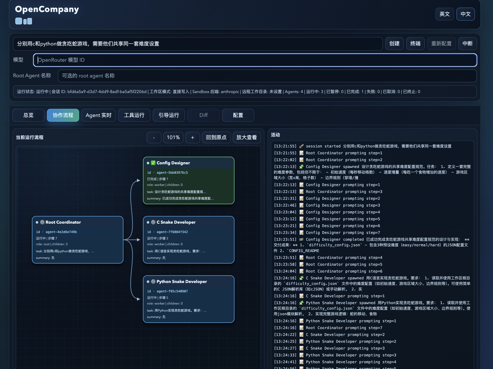
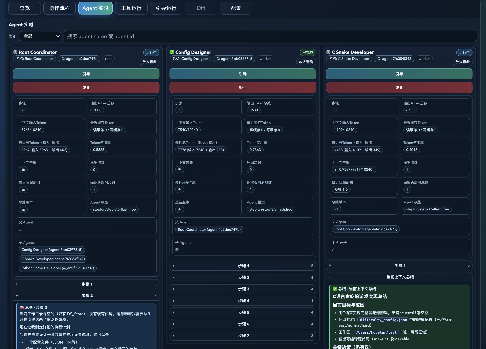

# OpenCompany

语言： [English](README.md) | **中文**

> ✨ 在 OpenCompany，每个 agent 与用户都能自组织地招募或终止团队，自主行动，并与其他 agent 协同沟通。
> 
> 🤖 代码基本由 [Codex](https://openai.com/codex/) 完成。
> 
> 📮 反馈：bebetterest@outlook.com

## 📚 目录

- ✨ 功能
- 📸 界面截图
- 🚀 快速上手（推荐 Web UI）
- 🖥️ TUI
- 💻 CLI 常用命令
- ⚙️ 配置与调试
- 🔒 运行时安全模型
- 🌐 Remote Direct 模式（SSH）
- 🗂️ 日志与持久化
- 🧱 仓库结构
- 📖 延伸阅读

## ✨ 功能

- 🧩 Agent 自组织：每个 `agent` 都可创建或终止子团队，拆解并分配任务、形成反馈循环；可向其他 agent 发送消息，完成后向上级提交结果。
- ⏱️ 异步执行：agent 可异步触发长耗时工具（如创建并分派子 agent、跨 agent 消息、长时 shell），并可自主查询 agent / tool 状态，决策继续执行或阻塞等待。
- 🎛️ Steerability：用户可随时创建、终止 agent，向任意 agent 发送 steer 消息，或打开与 agent 环境一致的终端直接操作。
- 🧠 上下文管理：agent 可自主按需调用上下文压缩工具，控制上下文膨胀并保留关键信息。
- 📏 限制策略：内置工具调用时长限制、可创建 agent 数限制、活跃 agent 数限制；当步数或上下文达到阈值时定期注入提醒；上下文超长会强制压缩。
- 🌐 项目环境：支持本地目录与远程 SSH Linux 目录作为执行环境。
- 📝 工作区模式：支持 `Direct` 与 `Staged`；`Direct` 直接写入项目目录，`Staged` 先暂存 diff 并在用户审批后应用（远程仅支持 `Direct`）。
- 🧰 Skills：session 可启用来自项目源/全局源的可复用 skill bundle；选中的 skills 会物化到 `.opencompany_skills/<session_id>/...`，并由 workers 继承使用。
- 📦 默认内置 skills：本仓库默认在 `skills/` 下提供一组从 Codex 改造为 OpenCompany 结构的 skills（当前包括 `pdf`、`openai-docs`、`skill-creator` 和 `skill-installer`）。
- 🔒 安全性：支持 `anthropic` [sandbox（SRT）](https://github.com/anthropic-experimental/sandbox-runtime) 与 `none`（不受限）两种运行后端。
- 🖥️ 三种界面：支持 Web UI / TUI / CLI，推荐 Web UI（可视化支持中英双语，可查看会话总览、协作结构、各 agent 详情、工具与引导信息，并支持创建/导入会话、修改配置、创建/引导/终止 agent、打开 agent 环境终端等操作）。
- 🤖 LLM 接入：支持通过 [OpenRouter](https://openrouter.ai/) 调用模型。

## 📸 界面截图





## 🚀 快速上手（推荐 Web UI）

1. 准备 Python 环境（两种方式任选其一，均包含可编辑安装与开发依赖）：

```bash
# 方案 A：Conda
conda env create -f environment.yml
conda activate OpenCompany

# 方案 B：uv
uv venv --python 3.12 .venv
source .venv/bin/activate
uv pip install -e ".[dev]"
```

`uv` 只负责安装 Python 包。继续之前，请先安装所需的系统工具：

```bash
# macOS 本机（Homebrew）
brew install ripgrep node

# Debian/Ubuntu Linux 主机（包含 Anthropic sandbox 的完整依赖集）
sudo apt-get update
sudo apt-get install -y ripgrep bubblewrap socat nodejs npm
```

`npm` 通常会随 Node.js 一起安装。若使用默认的 Anthropic sandbox 后端，Linux 执行主机还需要安装 `bubblewrap`（`bwrap`）和 `socat`；继续前请先确认 `node --version` 输出为 `18` 或更高版本。

2. 配置 OpenRouter API Key：

```bash
export OPENROUTER_API_KEY="your_api_key"
```

可选：

```bash
cp .env.example .env
```

3. 若使用 `[sandbox].backend = "anthropic"`（默认），安装 sandbox runtime 的 Node 依赖：

```bash
npm install
```

4. 若使用远程密码认证（`--remote-auth password`），在本机安装 `sshpass`：

```bash
# macOS
brew install hudochenkov/sshpass/sshpass

# Debian/Ubuntu
sudo apt-get install sshpass
```

5. 启动 Web UI：

```bash
opencompany ui
```

默认地址：`http://127.0.0.1:8765`

```bash
opencompany ui --host 0.0.0.0 --port 9090
```

## 🖥️ TUI

TUI 仍然可用，可作为回退界面：

```bash
opencompany tui
opencompany tui --project-dir /path/to/target
opencompany tui --workspace-mode staged
opencompany tui --session-id <session_id>
opencompany tui --remote-target demo@example.com --remote-dir /home/demo/workspace --remote-auth key --remote-key-path ~/.ssh/id_ed25519
```

规则：

- 远程参数仅用于新建会话。
- 不要将远程参数与 `--session-id` 同时使用。
- 不要将 `--workspace-mode` 与 `--session-id` 同时使用。
- `staged` 模式不支持远程工作区。
- 使用 `--session-id` 加载已有会话时，会直接绑定原 session，不会再隐式 clone。

## 💻 CLI 常用命令

在当前目录执行任务：

```bash
opencompany run "Inspect this repository and propose next engineering steps."
```

对其他项目目录执行任务：

```bash
opencompany run --project-dir /path/to/target "Inspect this repository and propose next engineering steps."
```

使用 staged 模式：

```bash
opencompany run --workspace-mode staged "Inspect this repository and propose next engineering steps."
```

显式指定 sandbox backend、模型和 root agent 名称：

```bash
opencompany run \
  --sandbox-backend none \
  --model openai/gpt-4.1-mini \
  --root-agent-name "Planner Root" \
  "Inspect this repository and propose next engineering steps."
```

发现可用 skills：

```bash
opencompany skills
opencompany skills --project-dir /path/to/target
opencompany skills --remote-target demo@example.com:22 --remote-dir /home/demo/workspace --remote-auth key --remote-key-path ~/.ssh/id_ed25519
```

添加 skill：

- 把 skill 目录放到 `<project_dir>/skills/` 或 `<app_dir>/skills/` 下即可参与发现。
- 但不是只有目录名就行；一个有效 skill 至少要包含 `skill.toml` 和 `SKILL.md`。
- 如果项目源和全局源里存在同一个 `skill_id`，项目源会覆盖全局源。
- 本仓库已经在 `skills/` 下内置了一组从 Codex 适配到 OpenCompany 结构的默认 skills。

```text
<project_dir>/skills/<skill_id>/
  skill.toml
  SKILL.md
  SKILL_cn.md        # 可选
  resources/...      # 可选；可包含文本、脚本或二进制文件
```

最小 `skill.toml` 示例：

```toml
[skill]
id = "repo-map"
name = "Repo Map"
name_cn = "仓库地图"
description = "Explain the repository layout and key entry points."
description_cn = "解释仓库结构和关键入口。"
tags = ["docs", "navigation"]
```

添加后可用下面的命令确认是否发现成功：

```bash
opencompany skills --project-dir /path/to/target
```

显式启用 skills 运行：

```bash
opencompany run \
  --skill repo-map \
  --skill release-notes \
  "Inspect this repository and propose next engineering steps."
```

在 direct 模式下连接远程 SSH 工作区执行：

```bash
opencompany run \
  --remote-target demo@example.com:22 \
  --remote-dir /home/demo/workspace \
  --remote-auth key \
  --remote-key-path ~/.ssh/id_ed25519 \
  --remote-known-hosts accept_new \
  "Inspect this repository and propose next engineering steps."
```

继续已有会话：

```bash
opencompany resume <session_id> "new instruction"
opencompany resume <session_id> --sandbox-backend anthropic --model openai/gpt-4.1-mini "new instruction"
opencompany resume <session_id> --skill repo-map --skill release-notes "new instruction"
```

若希望先分叉出一个副本，再继续执行：

```bash
opencompany clone <session_id>
opencompany clone <session_id> --app-dir /path/to/app
```

应用 / 撤销 staged 写回：

```bash
opencompany apply <session_id>
opencompany undo <session_id>
# 非交互
opencompany apply <session_id> --yes
opencompany undo <session_id> --yes
```

导出会话日志：

```bash
opencompany export-logs <session_id>
opencompany export-logs <session_id> --export-path /tmp/session-export.json
```

查询持久化消息：

```bash
opencompany messages <session_id>
opencompany messages <session_id> --agent-id <agent_id> --tail 100
opencompany messages <session_id> --cursor <next_cursor> --include-extra --format text
```

查询持久化 tool runs：

```bash
opencompany tool-runs <session_id>
opencompany tool-runs <session_id> --status running --limit 200 --cursor <next_cursor>
```

tool-run 指标：

```bash
opencompany tool-run-metrics <session_id>
opencompany tool-run-metrics <session_id> --export
opencompany tool-run-metrics <session_id> --export --export-path /tmp/tool_run_metrics.json
```

打开会话终端或执行终端策略一致性自检：

```bash
opencompany terminal <session_id>
opencompany terminal <session_id> --self-check
```

补充说明：

- `opencompany run` 与 `opencompany resume` 在交互终端会显示动态状态面板。
- `opencompany resume <session_id> ...` 会直接在原 session 上继续；若要保留原 session 并创建分支副本，请先执行 `opencompany clone <session_id>`。
- 面板默认每 `5s` 自动分页；可按 `=` / `+` / `-` 手动切页。
- 用 `--preview-chars N` 调整各字段预览宽度（默认 `256`）。
- 在 `run` / `resume` 中可用 `--sandbox-backend <name>` 仅覆盖本次调用的 `[sandbox].backend`。
- `opencompany run` 还支持 `--model <model>` 与 `--root-agent-name <name>`；`opencompany resume` 还支持 `--model <model>`。

## ⚙️ 配置与调试

`opencompany.toml` 是唯一配置事实来源。

核心配置分组：

- `[project]`：应用名、默认语言、运行数据目录。
- `[llm.openrouter]`：模型、重试策略、超时、采样参数。
- `[runtime.limits]`：编排限制（子 agent 数、活跃 agent 数、步数预算、提醒间隔）。
- `[runtime.tool_timeouts]`：默认与各工具超时。
- `[runtime.tools]`：root/worker 工具白名单、`steer_agent_scope`、列表分页、shell 前台等待时长。
- `[runtime.context]`：上下文压力检测与压缩配置。
- `[sandbox]`：后端、网络策略、域名白名单、超时。
- `[logging]`：会话事件/导出/诊断日志文件名。
- `[locale]`：系统语言无法识别时的回退语言。

当前仓库默认值包括：

- `[project].default_locale = "zh"`（若希望跟随系统语言请设为 `auto`）
- `[llm.openrouter].model = "stepfun/step-3.5-flash:free"`
- `[llm.openrouter].max_retries = 8`
- `[runtime.tool_timeouts].default_seconds = 30`
- `[runtime.tool_timeouts].shell_seconds = 300`
- `[runtime.tools].shell_inline_wait_seconds = 10`
- `[runtime.context].max_context_tokens = 51200`
- `[sandbox].backend = "anthropic"`
- `[sandbox].network_policy = "allowlist"`
- `[sandbox].timeout_seconds = 300`
- `[locale].fallback = "en"`

调试方式：

```bash
opencompany run --debug "Inspect this repository and propose next engineering steps."
opencompany resume <session_id> "new instruction" --debug
opencompany ui --debug
opencompany tui --debug
```

启用 `--debug` 后，API 请求/响应追踪会写入 `.opencompany/sessions/<session_id>/debug/`。

## 🔒 运行时安全模型

- root 与 worker 共享同一工具协议；prompt 会持续约束 root 以编排为先。
- agent 在隔离 workspace 中执行，并受显式预算约束。
- worker 完成后，改动才会提升回父 workspace。
- `staged` 模式下，root `finish` 只会暂存改动；需显式执行 `opencompany apply <session_id>` 才会写回项目。
- 已写回改动可用 `opencompany undo <session_id>` 回滚。
- 运行时使用明确状态机：
  - session：`running|completed|interrupted|failed`
  - completion 质量：`completed|partial`（仅在 session `completed` 时写入）
  - agent：`pending|running|paused|completed|failed|cancelled|terminated`

## 🌐 Remote Direct 模式（SSH）

范围与约束：

- 仅支持 `direct` 工作区模式。
- 远端主机必须是 Linux。
- 会话远程配置持久化路径：`.opencompany/sessions/<session_id>/remote_session.json`。
- 会话配置中不会保存明文密码。

认证与本地依赖：

- `--remote-auth key`：必须提供 `--remote-key-path`。
- `--remote-auth password`：运行时交互输入密码；本机必须安装 `sshpass`。
- `--remote-known-hosts` 支持 `accept_new`（默认）和 `strict`。

后端行为：

- `anthropic`：fail-closed 远程 sandbox 路径，通过 `srt` 执行并施加策略约束。
- `none`：直接在远端 `/bin/bash` 执行，不施加 sandbox 文件/网络约束。

依赖准备（anthropic 后端）：

- 运行时会进行 fail-closed 的依赖检查/准备。
- 会校验或尝试准备 `rg`、`bwrap`、`socat`、`Node.js >= 18`、`srt` 等关键依赖。
- 依赖无法满足时，run/validate 会失败并返回明确错误。

## 🗂️ 日志与持久化

- 会话事件：`.opencompany/sessions/<session_id>/events.jsonl`
- 每个 agent 的消息：`.opencompany/sessions/<session_id>/<agent_id>_messages.jsonl`
- 可选 API 调试追踪：`.opencompany/sessions/<session_id>/debug/<agent_id>__<module>.jsonl`
- 远程会话配置（远程模式）：`.opencompany/sessions/<session_id>/remote_session.json`
- 跨会话诊断日志：`.opencompany/diagnostics.jsonl`

`events.jsonl` / `export.json` / `diagnostics.jsonl` 文件名可在 `[logging]` 中调整。

## 🧱 仓库结构

- `src/opencompany/`：核心 Python 包
- `src/opencompany/webui/`：Web UI 后端与静态前端
- `src/opencompany/tui/`：Textual TUI
- `src/opencompany/tools/`：tool schema 注册与执行器
- `src/opencompany/orchestration/`：agent 运行时与编排流程
- `prompts/`：英文 prompts 与中文镜像
- `docs/`：文档索引、架构、技术路线、消息流文档（含中文镜像）
- `docs/modules/`：子系统模块文档
- `tests/`：单元/集成倾向测试

## 📖 延伸阅读

- `docs/README.md`
- `docs/technical_route.md`
- `docs/architecture.md`
- `docs/message_flow.md`
- `docs/message_stream_map.md`
- `docs/modules/runtime_core.md`
- `docs/modules/tool_runtime.md`
- `docs/modules/ui_surfaces.md`
- 中文镜像：`README_cn.md`、`docs/*_cn.md`
