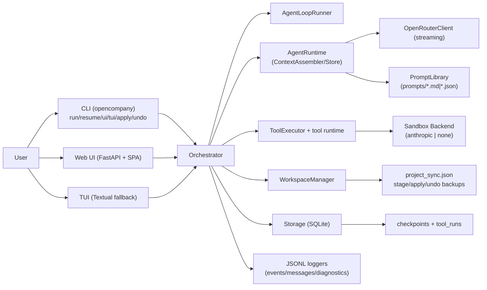
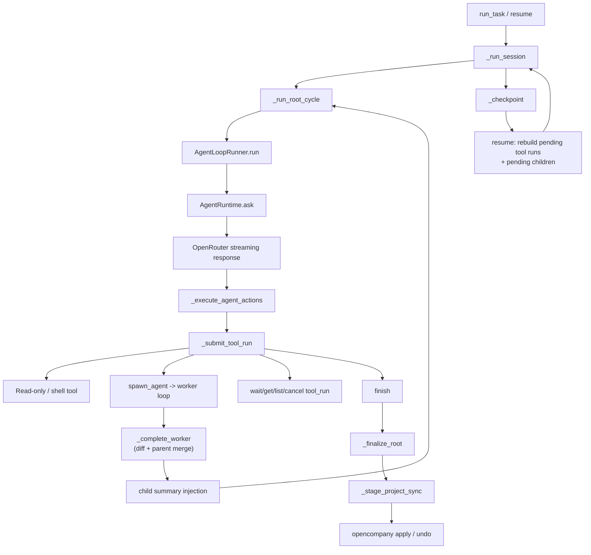

# Architecture

## System Components

## Runtime Execution Chain

## Key Architectural Decisions

1. One loop engine for root and worker; role differences are validated in runtime policy (`finish` fields/status).
2. Tool calls are persisted as `tool_runs` instead of ephemeral-only events.
3. Worker file deltas are merged upward before root finalization, then staged before project writeback.
4. Message-first replay source is per-agent `*_messages.jsonl`; runtime events remain secondary observability channels.
5. Resume is checkpoint-driven and reconstructs pending tool runs.

## Boundary and Safety Model

- Worker write scope is its sandbox workspace.
- In `staged` mode, root cannot directly write target project state without explicit user confirmation (`apply`).
- In `direct` mode (local or remote SSH workspace), writes are live under the selected sandbox backend policy (`anthropic` constrained, `none` unconstrained) and there is no staged apply/undo rollback layer.
- `undo` relies on staged backup metadata and copied files from last apply (`staged` mode only).
- Budget exhaustion paths force summary/finalization instead of hidden infinite loops.

## Module References

- `docs/modules/runtime_core.md`
- `docs/modules/orchestration_pipeline.md`
- `docs/modules/tool_runtime.md`
- `docs/modules/workspace_sync.md`
- `docs/modules/persistence_observability.md`
- `docs/modules/llm_prompts.md`
- `docs/modules/ui_surfaces.md`
- `docs/modules/testing_debugging.md`
