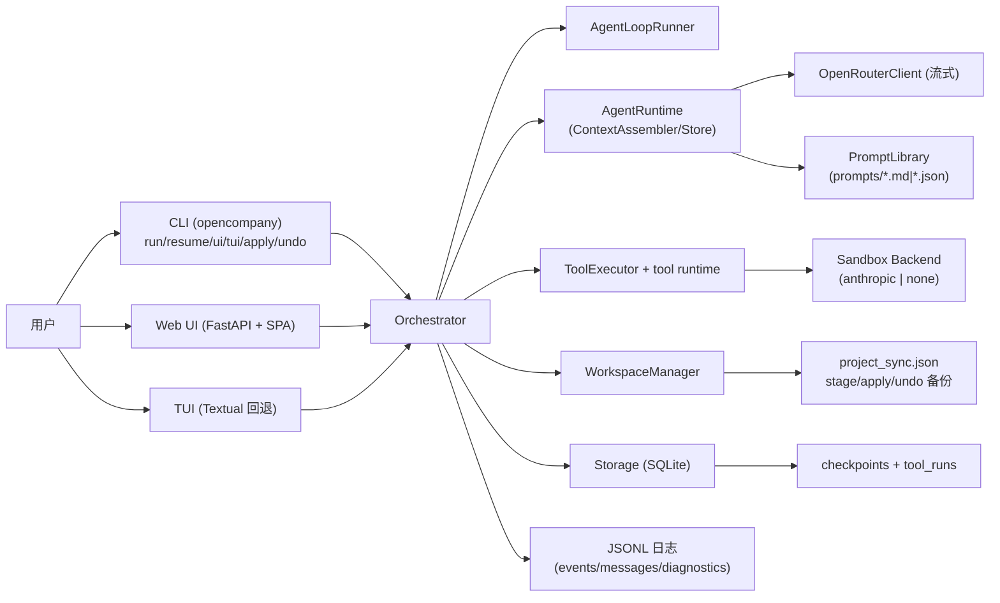
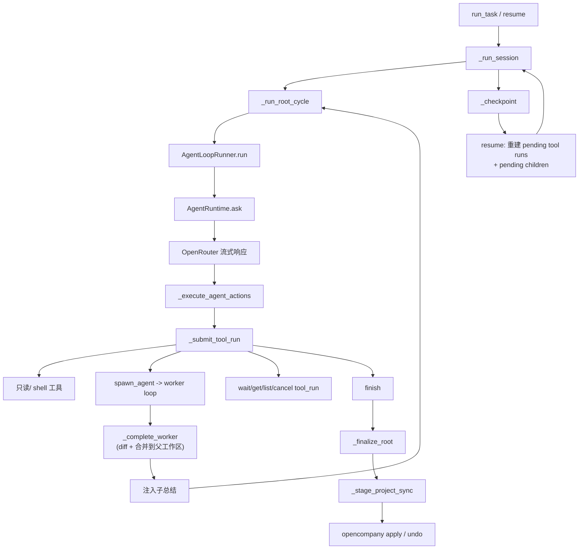

# 架构

## 系统组件

## 运行时执行链路

## 核心架构决策

1. root 与 worker 共用循环引擎，角色差异通过运行时策略校验（如 `finish` 字段/状态）。
2. 工具调用以 `tool_runs` 持久化，而非仅临时事件。
3. worker 文件增量先向上合并，再由 root 最终阶段暂存，最后由用户确认写回。
4. 对话重放主数据源为每 agent 的 `*_messages.jsonl`；runtime events 是辅助可观测通道。
5. resume 以 checkpoint 为中心，并重建所有 pending tool run。

## 边界与安全模型

- worker 写入范围限定在自身沙箱工作区。
- `staged` 模式下，未经用户 `apply`，root 不会直接改写目标项目目录。
- `direct` 模式下（本地或远程 SSH 工作目录），改动会按所选 sandbox backend 策略实时生效（`anthropic` 受约束，`none` 无约束），不存在 staged apply/undo 回滚层。
- `undo` 依赖上一次 apply 时记录的备份元数据与文件副本（仅 `staged` 模式可用）。
- 预算耗尽路径会强制总结/收尾，避免隐藏的无限循环。

## 模块文档入口

- `docs/modules/runtime_core.md`
- `docs/modules/orchestration_pipeline.md`
- `docs/modules/tool_runtime.md`
- `docs/modules/workspace_sync.md`
- `docs/modules/persistence_observability.md`
- `docs/modules/llm_prompts.md`
- `docs/modules/ui_surfaces.md`
- `docs/modules/testing_debugging.md`
